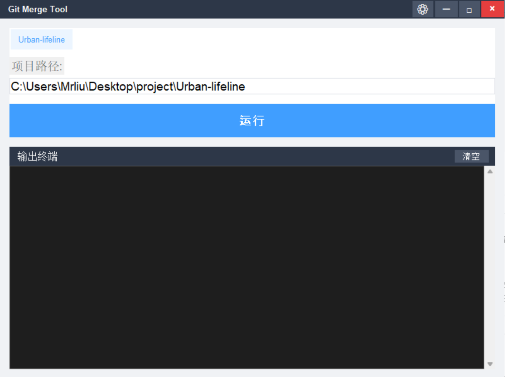
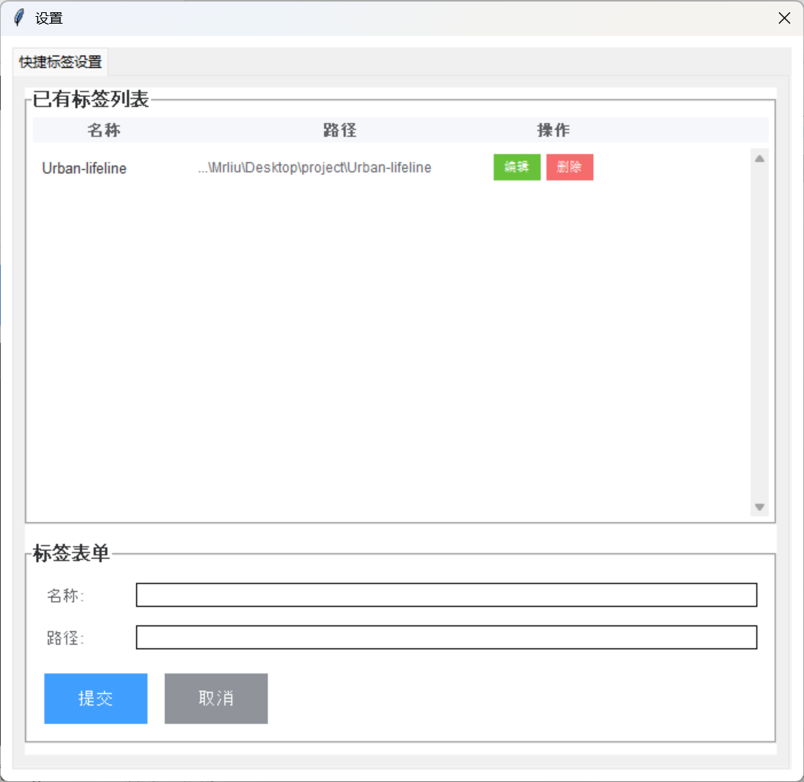

# Git分支合并工具

一个基于Python和Tkinter的Git分支合并GUI工具，用于简化Git分支合并工作流，特别是在处理多项目时提高工作效率。



## 功能特点

- 图形化界面，操作简单直观
- 自定义标题栏，设置按钮集成在窗口顶部
- 自动执行Git分支合并工作流
- 支持多项目快捷切换
- 实时显示命令执行状态和输出
- 快捷标签管理功能，支持添加、编辑、删除项目路径
- 支持超时机制，避免网络问题导致程序卡死
- 多线程处理，界面始终保持响应
- 独立GUI应用程序，打包后可直接双击exe文件运行


## 工作流程

此工具自动执行以下Git操作：

1. 从develop分支拉取最新代码并rebase当前开发分支
2. 切换到develop分支
3. 拉取develop分支最新代码
4. 将开发分支合并到develop分支
5. 推送更新后的develop分支到远程仓库
6. 切换回原开发分支

在合并过程中如遇到冲突，工具会暂停并提示用户手动解决冲突，解决后需要重新运行工具继续流程。

## 使用方法

### 系统要求

- Windows操作系统
- Python 3.6或更高版本
- Git客户端已安装并配置

### 启动方式

**推荐方式：**
1. 运行构建脚本生成exe文件：
   ```bash
   python build_exe.py
   ```
2. 在生成的`dist`目录中找到exe文件
3. 直接双击exe文件启动GUI应用程序

### 操作步骤

1. 在界面中输入或选择Git项目的本地路径
2. 点击"运行"按钮开始自动合并流程
3. 如遇到冲突，程序会暂停并提示手动解决
4. 解决冲突后，重新点击"运行"按钮继续执行
5. 完成后可通过终端右上角的"清空"按钮清空日志并准备下一次操作

### 快捷标签管理

工具会自动记住使用过的项目路径，并创建快捷标签。点击任意标签即可自动填充相应的项目路径。



**管理快捷标签：**
- 点击窗口右上角的设置按钮（⚙️）
- 选择"快捷标签设置"选项卡
- 在设置界面中可以：
  - 查看所有已有标签
  - 添加新的项目标签
  - 编辑现有标签的名称和路径
  - 删除不需要的标签
- 所有修改会自动保存，下次启动时仍然有效

### 故障排除

- **程序无响应**：新版本已修复此问题，现在使用多线程处理，界面始终保持响应
- **网络超时**：工具设置了合理的超时时间，网络问题会自动提示
- **操作卡住**：可使用终端右上角的"清空"按钮重置程序状态
- **路径不存在**：请确保输入的项目路径正确且包含.git目录

## 文件说明

- `git_merge_gui.py` - GUI界面实现，包含自定义标题栏和设置功能
- `git_merge_auto.py` - Git命令执行逻辑
- `启动Git合并工具.bat` - 快速启动批处理文件
- `git_macos_bigsur_icon_190141.ico` - 应用程序图标
- `quick_tags_config.json` - 快捷标签配置文件（自动生成）
- `build_exe.py` - 构建独立可执行exe文件的脚本

## 提示

- 使用前请确保当前分支的更改已提交
- 工具执行的是将当前分支合并到develop分支的操作
- 合并冲突需手动解决，然后重新运行工具
- 程序会实时显示各操作的执行状态和输出信息
- 网络较慢时请耐心等待，工具会自动处理超时情况
- 所有快捷标签配置都会持久化存储，下次启动时自动加载
- 设置按钮位于窗口标题栏右上角，与窗口控制按钮在同一行

## 许可证

本项目采用 MIT 许可证开源 - 查看 [LICENSE](LICENSE) 文件了解更多详情

```
MIT License

Copyright (c) 2023 项目作者

Permission is hereby granted, free of charge, to any person obtaining a copy
of this software and associated documentation files (the "Software"), to deal
in the Software without restriction, including without limitation the rights
to use, copy, modify, merge, publish, distribute, sublicense, and/or sell
copies of the Software, and to permit persons to whom the Software is
furnished to do so, subject to the following conditions:

The above copyright notice and this permission notice shall be included in all
copies or substantial portions of the Software.

THE SOFTWARE IS PROVIDED "AS IS", WITHOUT WARRANTY OF ANY KIND, EXPRESS OR
IMPLIED, INCLUDING BUT NOT LIMITED TO THE WARRANTIES OF MERCHANTABILITY,
FITNESS FOR A PARTICULAR PURPOSE AND NONINFRINGEMENT. IN NO EVENT SHALL THE
AUTHORS OR COPYRIGHT HOLDERS BE LIABLE FOR ANY CLAIM, DAMAGES OR OTHER
LIABILITY, WHETHER IN AN ACTION OF CONTRACT, TORT OR OTHERWISE, ARISING FROM,
OUT OF OR IN CONNECTION WITH THE SOFTWARE OR THE USE OR OTHER DEALINGS IN THE
SOFTWARE.
```